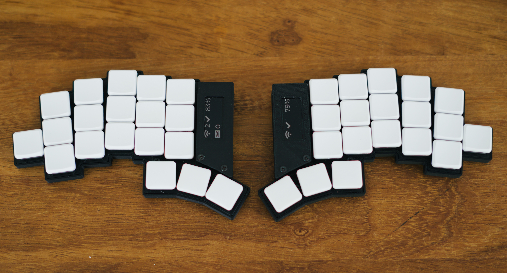
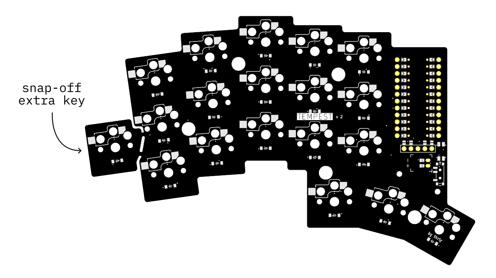

# Build Guide

The build for the TEMPEST is simple and broadly follows the same steps outlined in [Typeractive's Corne build](https://docs.typeractive.xyz/build-guides/corne-wireless). Theirs is well-written and documented, so read that for now.

Some important notes, however:

Before starting your build, decide if you want the 'extra' outer keys or want the simple 5-column 36-key configuration. If removing the extra keys, simply snap them off the pcb. You may find the break-off points are sharp, so file/sand them down. **WARNING**: the dust from this is toxic, wear a mask and do it outside.

> [!IMPORTANT]
> Microcontroller should be placed **facing DOWN** (i.e. facing the board).

> [!NOTE]
> The microcontroller pin holes on the board have been narrowed (to 0.85mm) to enable the use of no-solder spring headers (MAC8 XB-3-5, as found from [Typeractive](https://typeractive.xyz/products/no-solder-spring-headers?variant=47196312502503)). These headers will fit the nice!nano, but other Pro Micro controllers may have pin holes that are too wide for these spring headers.

> [!IMPORTANT]
> Ensure that you solder the jumper pads for microcontroller, display, and battery plug closed **on the BACK side of the board** (i.e. the same side you're soldering your hotswap switch plugs and diodes).

## Case

Files for a simple 3D-printed case included [here](/case/). Reccomended print in Matte PLA, with 0.12 layer height. Infill is not really relevant as the walls are thin.

> [!TIP]
> Alternatively, use the back-plate and top-plate exports from ergogen to order FR-4 plates along with your PCB. You can also use the DXF exports to design your own 3D-printed case/plates easily.

## Ergogen

The ergogen YAML and footprints are contained in the [ergogen](/ergogen/) directory. With the ergogen cli tool installed, use `ergogen .` to build. See [here](https://docs.ergogen.xyz/usage) for guidance.

Ergogen was used mainly as a layout tool for the keys and wiring nets. Some of the footprints for things like MCU, switches, plugs, etc. may have been manually tweaked in the KiCad PCB editor, so don't expect the Ergogen render to be completely the same as the final PCB version.

> [!NOTE]
> Some of the ergogen/ceoloide footprint files used here have been modified slightly from the [originals](https://github.com/ceoloide/ergogen-footprints). Run locally, not on the ergogen web app.

## Ordering the PCB

Use [tempest_v2_gerbers.zip](./tempest-v2-gerbers.zip) for PCB fabrication (i.e. JLPCB, PCBWay).

### Suggested fabrication options

- FR-4 PCB, 1.6 mm
- LeadFree HASL

Latest [KiCad_PCB file](./tempest-pcb-v-2.kicad_pcb) is included, or files can be generated using Ergogen.

> Tempest PCB v2
