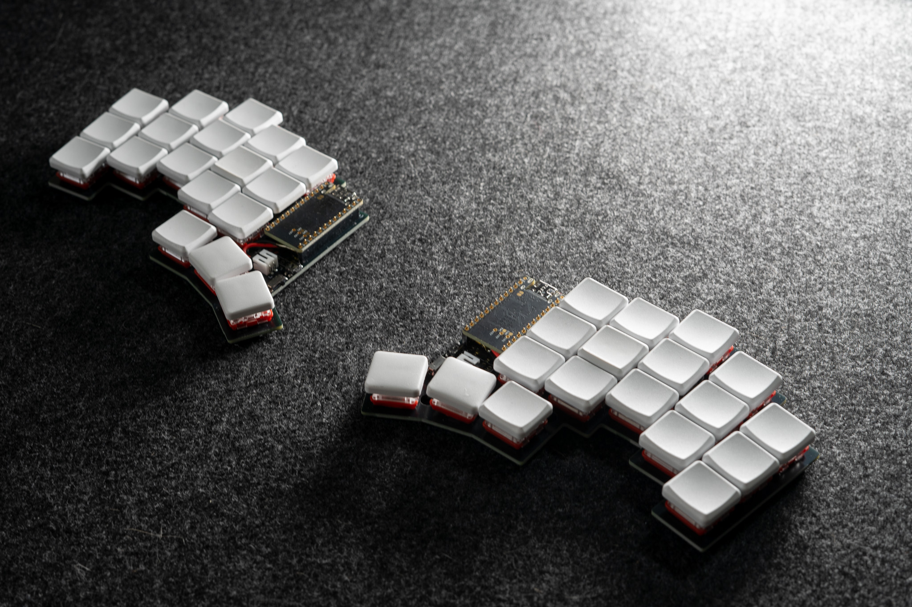

# Build Guide

The build for the TEMPEST is simple and broadly follows the same steps outlined in [Typeractive's Corne build](https://docs.typeractive.xyz/build-guides/corne-wireless). Theirs is well-written and documented, so read that for now.

Some important notes, however:

> [!IMPORTANT]
> Microcontroller should be placed **facing DOWN** (i.e. facing the board).

> [!NOTE]
> The microcontroller pin holes on the board have been narrowed (to 0.85mm) to enable the use of no-solder spring headers (MAC8 XB-3-5, as found from [Typeractive](https://typeractive.xyz/products/no-solder-spring-headers?variant=47196312502503)). These headers will fit the nice!nano, but other Pro Micro controllers may have pin holes that are too wide for these spring headers.

> [!IMPORTANT]
> Ensure that you solder the jumper pads for microcontroller, display, and battery plug closed **on the BACK side of the board** (i.e. the same side you're soldering your hotswap switch plugs and diodes).

## Bill of Materials (BOM)

| Quantity | Part                                                                                                                                         | Notes                                                                                                            |
| -------- | -------------------------------------------------------------------------------------------------------------------------------------------- | ---------------------------------------------------------------------------------------------------------------- |
| 2        | TEMPEST PCBs (reversible) from [gerbers .zip file](/tempest%201-1%20gerbers.zip)                                                             | order from [JLCPCB](https://jlcpcb.com/) or similar                                                              |
| 2        | nice!nano                                                                                                                                    | or other Pro Micro controller (see note about spring headers)                                                    |
| 2        | Li-Po battery (110 mAh) | [Typeractive](https://typeractive.xyz/products/lithium-battery-110mah) / [AliExpress](https://www.aliexpress.us/item/3256805162053912.html), see nice!nano documentation for reccomendations, with 2-pin JST plug                                             |
| 2        | 2-pin right-angled JST plug                                                                                                                  | 2.0mm pin spacing; [AliExpress](https://www.aliexpress.com/item/1005004955655144.html) (NOTE: black seem to be harder to find than white)                                                |
| 2        | Miniature Alps SPDT switch (7 pin)                                                                                                           | Power on/off; MSK-12C02 [AliExpress](https://www.aliexpress.com/item/4000685483225.html) (NOTE: if there are two small bumps on the base, you can just slice them off with a knife to sit flush on the PCB)                                                                                                     |
| 2        | Miniature momentary button (side mount)                                                                                                      | Reset; [AliExpress](https://www.aliexpress.com/item/1005002845025014.html)                                                                                                            |
| 4        | 12-pin headers (5mm height)                                                                                                                  | MAC8 XB-3-5 from [Typeractive](https://typeractive.xyz/products/no-solder-spring-headers?variant=47196312502503) |
| 38*    | 1N4148W SMD diodes | SOD-123 package size                                                          |
| 38*    | Kailh choc switches (v1)                                                         |
| 38*    | Kailh choc hotswap sockets                                                       |
| 38*    | Choc keycaps                                                                     |

\* 36 if you're snapping off the "extra" outer keys

### Optional: Display

| Quantity | Part                      | Notes                                                                                                            |
| -------- | ------------------------- | ---------------------------------------------------------------------------------------------------------------- |
| 2        | nice!view display         |
| 2        | 5-pin header (7mm height) | MAC8 XB-3-7 from [Typeractive](https://typeractive.xyz/products/no-solder-spring-headers?variant=47196312535271) |

### Optional: Case

| Quantity | Part                 | Notes                                                         |
| -------- | -------------------- | ------------------------------------------------------------- |
| 2        | case .stl            | Mirror for right side; PLA; 0.12 mm layer height; >50% infill |
| 2        | key plate STL        | Mirror for right side; PLA; 0.12 mm layer height; >50% infill |
| 2        | stick-on rubber feet | or magsafe disc / tenting legs from aliexpress                |
| 10       | M2 standoffs         | height: 4 mm; diameter: < 5 mm |
| 20       | M2 bolts             | height: 4 mm                                                  |

## Case

Files for a simple 3D-printed case included [here](/case/). Reccomended to print in Matte PLA, with 0.12 layer height. Infill is not really relevant as the walls are thin.

> [!TIP]
> Alternatively, use the back-plate and top-plate exports from ergogen to order FR-4 plates along with your PCB. You can also use the DXF exports to design your own 3D-printed case/plates easily.

## Ergogen

The ergogen YAML and footprints are contained in the [ergogen](/ergogen/) directory. With the ergogen cli tool installed, use `ergogen .` to build. See [here](https://docs.ergogen.xyz/usage) for guidance.

Ergogen was used mainly as a layout tool for the keys and wiring nets. Some of the footprints for things like MCU, switches, plugs, etc. may have been manually tweaked in the KiCad PCB editor, so don't expect the Ergogen render to be completely the same as the final PCB version.

> [!NOTE]
> Some of the ergogen/ceoloide footprint files used here have been modified slightly from the [originals](https://github.com/ceoloide/ergogen-footprints). Run locally, not on the ergogen web app.

## Ordering the PCB

Use [tempest_gerbers_v2.zip](/tempest_gerbers_v1.zip) for PCB fabrication (i.e. JLPCB, PCBWay).

### Suggested fabrication options

- FR-4 PCB, 1.6 mm
- LeadFree HASL

Latest [KiCad_PCB file](/tempest_pcb_v1.1.kicad_pcb) is included, or files can be generated using Ergogen.

> Tempest PCB v2
